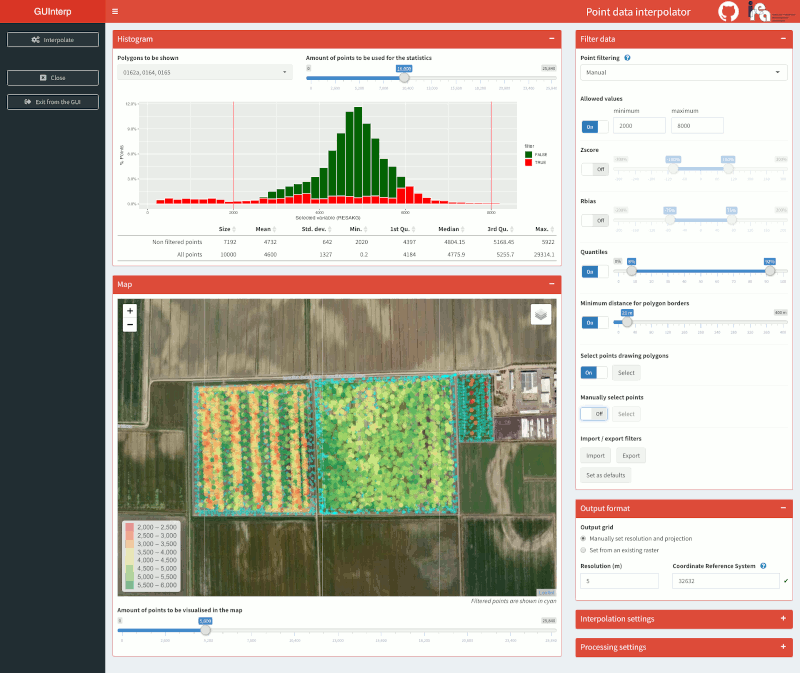

<!-- IMPORTANT: do NOT edit README.Rmd! Edit index.Rmd instead, -->

<!-- and generate README.Rmd using utils/code/create_README.sh  -->

[](https://travis-ci.com/ranghetti/guinterp)
[](http://www.gnu.org/licenses/gpl-3.0)
[](http://guinterp.ranghetti.info/.github/CODE-OF-CONDUCT.html)

# GUInterp: a Shiny GUI for spatial interpolation

GUInterp is a Graphical User Interface (GUI) supporting the spatial
interpolation of points data. The purpose of the GUI is to provide
graphical tools to perform the steps commonly required to interpolate
points data within defined borders: filtering outliers, defining a
suitable variogram (in case of Kriging interpolation), choosing the grid
of the output raster and setting the best options to weigh up
computational speed and output accuracy.

GUInterp is currently in beta version.

## Installation

The package can be installed from GitHub:

``` r
install.packages("remotes")
remotes::install_github("ranghetti/guinterp")
```

## Usage

The GUI can be launched with the following command:

``` r
library(guinterp)
guinterp()
```

<p style="text-align:center;">

<a href="https://raw.githubusercontent.com/ranghetti/guinterp/devel/man/figures/guinterp-0.png" target="_blank">
 </a>

</p>

Once opened, the GUI allows user to import a points dataset and an
optional polygon file of borders (alternatively, the bounding box of
points is used). Points data must contain the variable to be
interpolated (a selector allows selecting it). In case multiple polygons
are loaded, they can be treated as separate objects during
interpolation.

After loading files, the main GUI appears. In the left column, data can
visualised thanks to a histogram and a map; both of them highlight
filtered vs. non-filtered points. The right column incudes parameter
selectors, organised in four boxes:

  - **Filter data** contains selectors useful to filter data;
  - **Output format** allows defining the output raster grid;
  - **Interpolation settings** allows choosing the interpolation method
    (IDW or Kriging) and, in this case, defining the semivariogram model
    with another interactive interface;
  - **Processing settings** includes fine-tuning settings to speed-up
    interpolation.

## Credits

GUInterp is being developed by Luigi Ranghetti and Lorenzo Busetto
([IREA-CNR](http://www.irea.cnr.it)), and it is released under the [GNU
General Public License
version 3](https://www.gnu.org/licenses/gpl-3.0.html) (GPL‑3).

To cite this package, please use the following entry:

L. Ranghetti, M. Boschetti, D. Cillis, L. Busetto (2020). **“GUInterp: a
Shiny GUI to support spatial interpolation”**. *European R users meeting
(eRum)*, Milano, 17-20/06/2020.
<a href="https://2020.erum.io" target="_blank">https://2020.erum.io/program/contributed-sessions/</a>.

``` bibtex
@InProceedings{guinterp_erum,
  author    = {Ranghetti, Luigi and Boschetti, Mirco and Cillis, Donato and Busetto, Lorenzo},
  title     = {"GUInterp": a Shiny GUI to support spatial interpolation},
  booktitle = {European R users meeting (eRum), Milano, 17-20/06/2020},
  year      = {2020},
  url       = {https://2020.erum.io/program/contributed-sessions/},
}
```

## Contributing

This project is released with a [Contributor Code of
Conduct](http://guinterp.ranghetti.info/.github/CODE-OF-CONDUCT.html).
By participating in this project you agree to abide by its terms.
